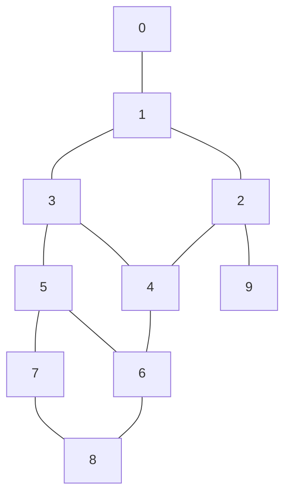

# Planar Network Diversion

Source code for the implementation for the paper Planar Network Diversion.

Build and run the code:

```
git clone git@github.com:Algoritmegruppen/planar-network-diversion
cd planar-network-diversion
cargo build --release
cp target/release/planar_network_diversion pnd
./pnd file.in s t b1 b2
```

Note that `file.in` needs to be a graph with a straight-line embedding:

* The first line of the input is `n m`
* Then follow `n` lines, `v_id x y` where `v_id` is the unique id of a vertex
* Then follow `m` lines, `v_id u_id weight`

Suppose you have the following example input file `example.in` and run with `./pnd example.in 0 9 7 8`, you will get the following output:

```
1,2
3,4
5,6
```

which is the unique solution to Planar Network Diversion.

```
10 12
0 0 0
1 1 0
2 2 0
3 1 1
4 2 1
5 1 2
6 2 2
7 1 3
8 2 3
9 3 0
0 1 1
1 2 1
1 3 1
2 4 1
2 9 1
3 4 1
3 5 1
4 6 1
5 6 1
5 7 1
6 8 1
7 8 1
```



In the above graph, with `s = 0`, `t = 9`, and `b = 7--8`, the unique solution is to remove edges `1--2`, `3--4`, and `5--6`.
